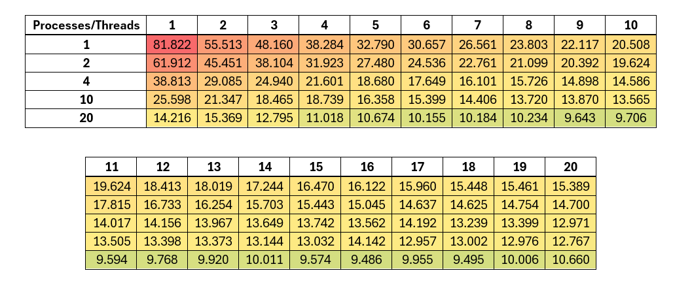
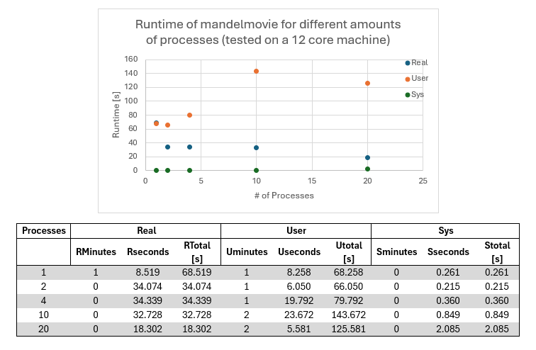
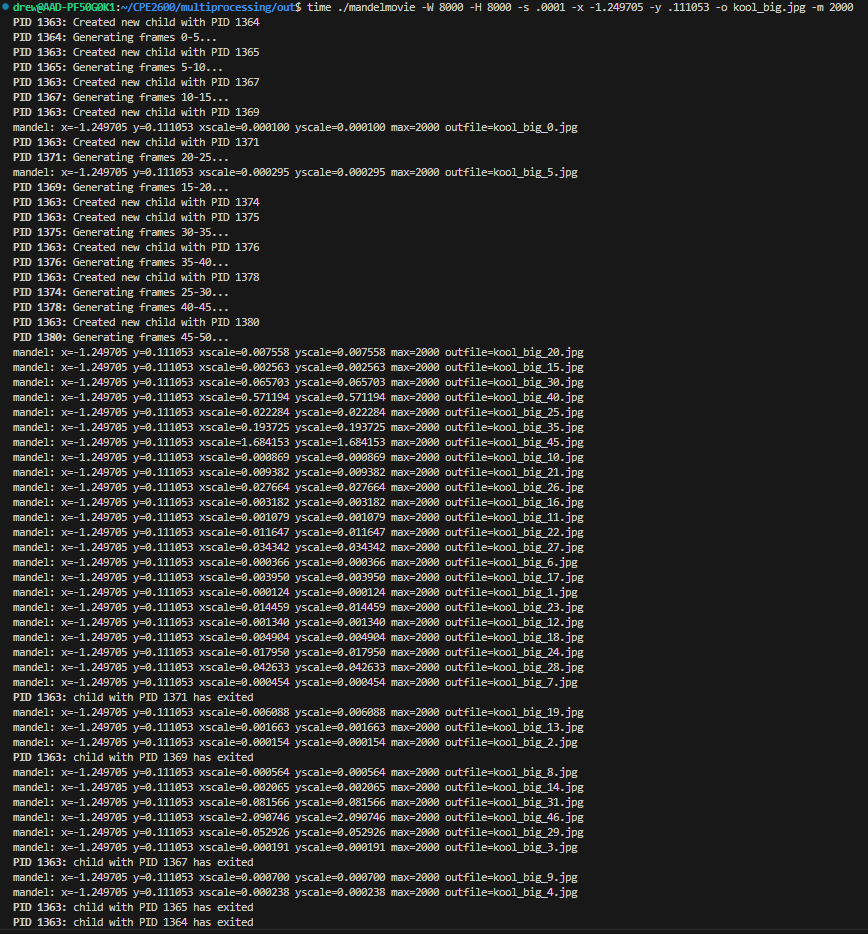
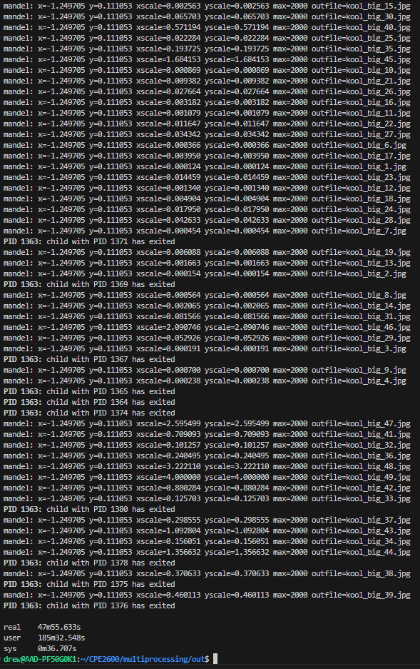

# Systems Programming Lab 12 Multithreading

**IMPORTANT:**

**TL;DR** Do a shallow clone.

I uploaded a really big video and some large image files to this repo, which has slowed git's performance a lot.
I tried removing the big images, but git is still slow and I think this is because the big files still exist "in the past".
Git makes it really hard to rewrite history (which is a good thing), but this also means it would be really hard to get these huge files out of my repo and it would be a scary destructive action that I don't want to risk.

So instead, I am just dealing with it. But you might not have to. Try doing a "shallow clone" when you download this repo, and only go one commit deep. This should mean you don't ever download those big images. I don't know if it will prevent git from being really slow and sluggish, but it's worth a shot.

## My implementation

The new version of the `mandel` program takes an addition option: the number of threads to use, with a default of 1.
Using this new option as well as the already-available ones, the program determines the size of the image and then
calculates the number of pixels each thread will be given to generate. Since this may not be an integer,
it is rounded up for now (the innacuracies will be accounted for later).

The previous version of the program looped through each row and column to cover every pixel. This divides the image into
multiple loops, whose bounds may overlap with the threads' ranges in ways that make it
difficult to implement cleanly and efficiently. The solution I came up with is to go through the image as one long array
of pixels, and for each pixel, to calculate the x and y coordinates using modulo and integer division, respectively.
These x and y coords can then be used as they were previously, with the benefit of everything being in one loop.

In the new version of `mandel`, the bounds of this loop are split among the different threads by multiplying
the number of pixels per thread by the index of that thread (which starts at 0 and is incremented as I loop through
the creation of each thread). To avoid giving the threads a total number of pixels that is higher than the number
of pixels in the image (a result of the rounding from earlier), the ending bound is set to the minimum between the
calculated value (which may be too large), and the total number of pixels in the image.

# Benchmarking

The number of processes affected the output a lot more than the number of threads. My hypothese as to why is that more complicated images will have a lot of complicated pixels, while less complicated images will have a lot of less complicated pixels. So, the number of threads will speed up processing considerably per image, especially when starting from 1 thread, but a hard image will always be hard and an easy image will always be easy. Adding multiple processes allows the program to work on a bunch of easy images while also working on a hard image at the same time, whereas with only 1 process those hard images took up a lot of time, as seen with the huge increase in runtime when no parallelization was attempted.

20 processes and 16 threads is the winner for lowest runtime, although all the tests on 20 processes past 4 threads were very similar, so I'd say 20 processes and 4 threads is the "sweet spot" for optimum runtime.

# Lab 11 Multiprocessing

## This is stuff that was in the README before Lab 12 (you've already seen it before).

## mandelmovie

My implementation of the `mandelmovie` program executes the original mandel program directly.
It starts off by parsing program arguments in a similar way to `mandel`, with the added option
of `-c` to specify the number of child processes to spawn (default 10).

Since multiple frames are generated with each being slightly different, that means we need to
have a list of scale parameters with each value being a little different than the next to achieve the zooming out effect. In the case of the Mandelbrot set, in order for the zoom to look good,
an exponential growth formula is best suited for the job. My original goal was to have the
animation pan as well as zoom so that it would end on a centered image of the Mandelbrot set,
but I was unable to find a formula for the x and y values that did not move the camera to a
"boring" part of the set away from the area of focus. Instead, I have chosen to leave these
values constant and end the zoom slightly off center.

Another possible improvement would be to add an ease-in and ease-out to the exponential growth
functions that calculates the scale values. This would give the animation a smooth start and stop
instead of the quick and jerky beginning and end seen in my video.

## How # of processes affects runtime

As for the runtime, please see the image below for my graph and the data I measured to compare
how the program ran with different numbers of child processes:

As shown, the "Real" time (which is what we actually experience)
decreases as the number of processes goes up. My computer only has
12 cores, though, so at 20 processes it must have been doing some "multitasking"
in order for things to work. This can actually slow down a program,
or at the very least cause it to not realize any performance gain.

I have had much success using my program's default of 10 children,
and it is of course less than the number of cores I have, so
that is what I'll be recommending as the best amount of multiprocessing
for this scenario.

### Cool image to zoom out from:
`./mandel -s .0001 -x -1.249705 -y .111053 -o kool.jpg`

`./mandel -W 8000 -H 8000 -s .0001 -x -1.249705 -y .111053 -o kool_big.jpg`

Video of `kool_big` located at `kool_big/kool_big.mpg`. Need to use VLC to play it.
<video src="kool_big/kool_big.mpg" width="1280" type="video/mpeg" controls></video>

### Output from when I generated kool_big

It took almost an hour to generate all those huge frames but it was worth it.

FFmpeg crashed my whole system the first couple times I tried to encode it.

I guess 8000x8000 pixel images are hard to encode.... who knew!

Solution was to use `-scale "1280:-1"` to make the video smaller.
